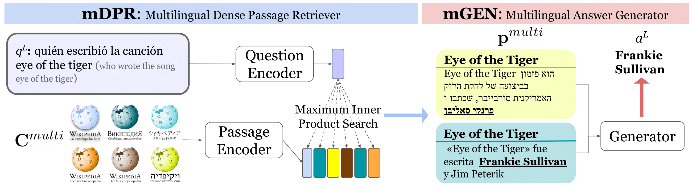
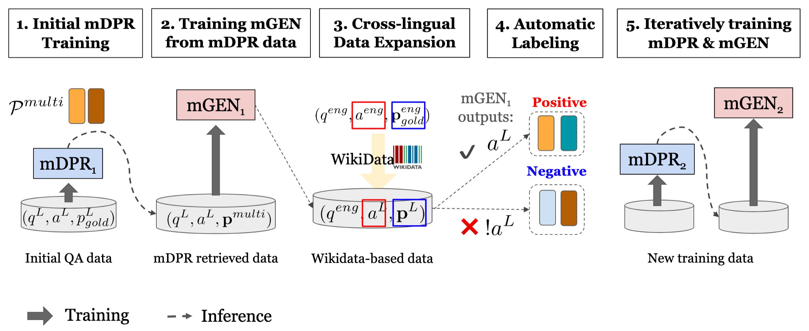

# CORA
This is the official implementation of the following paper:
Akari Asai, Xinyan Yu, Jungo Kasai and Hannaneh Hajishirzi. [One Question Answering Model for Many Languages with Cross-lingual Dense Passage Retrieval](https://arxiv.org/abs/2107.11976). *NeurIPS*. 2021. 



In this paper, we introduce **CORA**, a single, unified multilingual open QA model for many languages.      
CORA consists of two main components: **mDPR** and **mGEN**.     
**mDPR** retrieves documents from multilingual document collections and **mGEN** generates the answer in the target languages directly instead of using any external machine translation or language-specific retrieval module.      
Our experimental results show state-of-the-art results across two multilingual open QA dataset: [XOR QA](https://nlp.cs.washington.edu/xorqa/) and [MKQA](https://github.com/apple/ml-mkqa). 

##  Contents
0. [Quick Run on XOR QA](#quick-run-on-xor-qa)
1. [Overview](#overview)
2. [Data](#data)
3. [Installation](#installation)
4. [Training](#training)
5. [Evaluation](#evaluation)
6. [Citations and Contact](#citations-and-contact)

## Quick Run on XOR QA
We provide [quick_start_xorqa.sh](quick_start_xorqa.sh), with which you can easily set up and run evaluation on the XOR QA full dev set.

The script will
1. download our trained mDPR, mGEN and encoded Wikipedia embeddings,
2. run the whole pipeline on the evaluation set, and 
3. calculate the QA scores. 

You can download the prediction results from [here](https://drive.google.com/file/d/1lokVB9ngbOeD26PFBL_4O3h1E4B0saN-/view?usp=sharing).

## Overview
To run **CORA**, you first need to preprocess Wikipedia using the codes in [wikipedia_preprocess](wikipedia_preprocess).      
Then you train [mDPR](mDPR) and [mGEN](mGEN).      
Once you finish training those components, please run evaluations, and then evaluate the performance using [eval_scripts](eval_scripts).

Please see the details of each components in each directory. 

- [mDPR](mDPR): codes for training and evaluating our mDPR.
- [mGEN](mGEN): codes for training and evaluating our mGEN.
- [wikipedia_preprocess](wikipedia_preprocess): codes for preprocessing Wikipedias.
- [eval_scripts](eval_scripts): scripts to evaluate the performance. 


## Data
### Training data
You can download the mDPR train data from [here](https://drive.google.com/drive/folders/17xXq9hnUdpnE6XDHDdr6Wdv0tvOGtS4i?usp=sharing).
- [Initial train data](https://drive.google.com/file/d/1kyitGIjkrAgjTmMaC23pp6C_VIWn0v8M/view?usp=sharing)
- [Train data after the first iteration](https://drive.google.com/file/d/11Za61llqxstKhESrSQww-1WqBDNz_OqU/view?usp=sharing)
- [Final train data (after two iterations)](https://drive.google.com/file/d/1YyG1VjuPN2fh7J_tHEzR1-XDTyEC9cZY/view?usp=sharing)

### Evaluation data
We evaluate our models performance on XOR QA and MKQA. 

- XOR QA 
Please download the XOR QA (full) data by running the command below.

```sh
mkdir data
cd data
wget https://nlp.cs.washington.edu/xorqa/XORQA_site/data/xor_dev_full_v1_1.jsonl
wget https://nlp.cs.washington.edu/xorqa/XORQA_site/data/xor_test_full_q_only_v1_1.jsonl
cd ..
```

- MKQA
Please download the original MKQA data from the original repository.

```sh
wget https://github.com/apple/ml-mkqa/raw/master/dataset/mkqa.jsonl.gz
gunzip mkqa.jsonl.gz
```
Before evaluating on MKQA, you need to preprocess the MKQA data to convert them into the same format as XOR QA. Please follow the instructions at [eval_scripts/README.md](eval_scripts/README.md).


## Installation

### Dependencies 
- Python 3
- [PyTorch](https://pytorch.org/) (currently tested on version 1.7.0)
- [Transformers](https://github.com/huggingface/transformers) (version 4.2.1; unlikely to work with a different version)

### Trained models
You can download trained models by running the commands below:
```sh
mkdir models
wget https://nlp.cs.washington.edu/xorqa/cora/models/all_w100.tsv
wget https://nlp.cs.washington.edu/xorqa/cora/models/mGEN_model.zip
wget https://nlp.cs.washington.edu/xorqa/cora/models/mDPR_biencoder_best.cpt
unzip mGEN_model.zip
mkdir embeddings
cd embeddings
for i in 0 1 2 3 4 5 6 7;
do 
  wget https://nlp.cs.washington.edu/xorqa/cora/models/wikipedia_split/wiki_emb_en_$i 
done
for i in 0 1 2 3 4 5 6 7;
do 
  wget https://nlp.cs.washington.edu/xorqa/cora/models/wikipedia_split/wiki_emb_others_$i  
done
cd ../..
```

## Training
CORA is trained with our **iterative training process**, where each iteration proceeds over two states: *parameter updates* and *cross-lingual data expansion*.  

1. Train mDPR with the current training data. For the first iteration, the training data is the gold paragraph data from Natural Questions and TyDi-XOR QA.  
2. Retrieve top documents using trained mDPR 
3. Train mGEN with retrieved data
4. Run mGEN on each passages from mDPR and synthetic data retrieval to label the new training data. 
5. Go back to step 1. 



See the details of each training step in [mDPR/README.md](mdpr/README.md) and [mGEN/README.md](mGEN/README.md).

## Evaluation

1. Run mDPR on the input data

```sh
python dense_retriever.py \
    --model_file ../models/mDPR_biencoder_best.cpt \
    --ctx_file ../models/all_w100.tsv \
    --qa_file ../data/xor_dev_full_v1_1.jsonl \
    --encoded_ctx_file "../models/embeddings/wiki_emb_*" \
    --out_file xor_dev_dpr_retrieval_results.json \
    --n-docs 20 --validation_workers 1 --batch_size 256 --add_lang
```

2. Convert the retrieved results into mGEN input format

```sh
cd mGEN
python3 convert_dpr_retrieval_results_to_seq2seq.py \
    --dev_fp ../mDPR/xor_dev_dpr_retrieval_results.json \
    --output_dir xorqa_dev_final_retriever_results \
    --top_n 15 \
    --add_lang \
    --xor_engspan_train data/xor_train_retrieve_eng_span.jsonl \
    --xor_full_train data/xor_train_full.jsonl \
    --xor_full_dev data/xor_dev_full_v1_1.jsonl
```

3. Run mGEN
```sh
CUDA_VISIBLE_DEVICES=0 python eval_mgen.py \
    --model_name_or_path \
    --evaluation_set xorqa_dev_final_retriever_results/val.source \
    --gold_data_path xorqa_dev_final_retriever_results/gold_para_qa_data_dev.tsv \
    --predictions_path xor_dev_final_results.txt \
    --gold_data_mode qa \
    --model_type mt5 \
    --max_length 20 \
    --eval_batch_size 4
cd ..
```

4. Run the XOR QA full evaluation script
```sh
cd eval_scripts
python eval_xor_full.py --data_file ../data/xor_dev_full_v1_1.jsonl --pred_file ../mGEN/xor_dev_final_results.txt --txt_file
```

## Baselines
In our paper, we have tested several baselines such as Translate-test or multilingual baselines. The codes for machine translations or BM 25-based retrievers are at [baselines](baselines). To run the baselines, you may need to download code and mdoels from [the XOR QA repository](https://github.com/AkariAsai/XORQA). Those codes are implemented by [Velocity](https://github.com/velocityCavalry) :)


## Citations and Contact

If you find this codebase is useful or use in your work, please cite our paper.
```
@inproceedings{
asai2021cora,
title={One Question Answering Model for Many Languages with Cross-lingual Dense Passage Retrieval},
author={Akari Asai and Xinyan Yu and Jungo Kasai and Hannaneh Hajishirzi},
booktitle={NeurIPS},
year={2021}
}
```
Please contact Akari Asai ([@AkariAsai](https://twitter.com/AkariAsai) on Twitter, akari[at]cs.washington.edu) for questions and suggestions.
